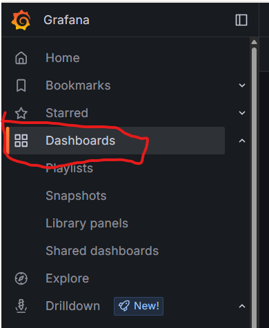
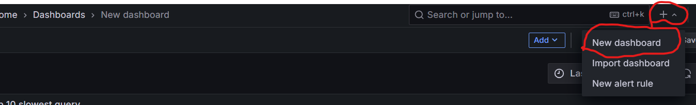
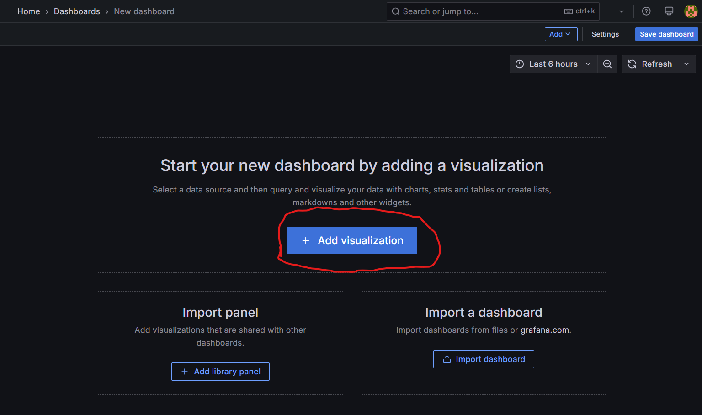
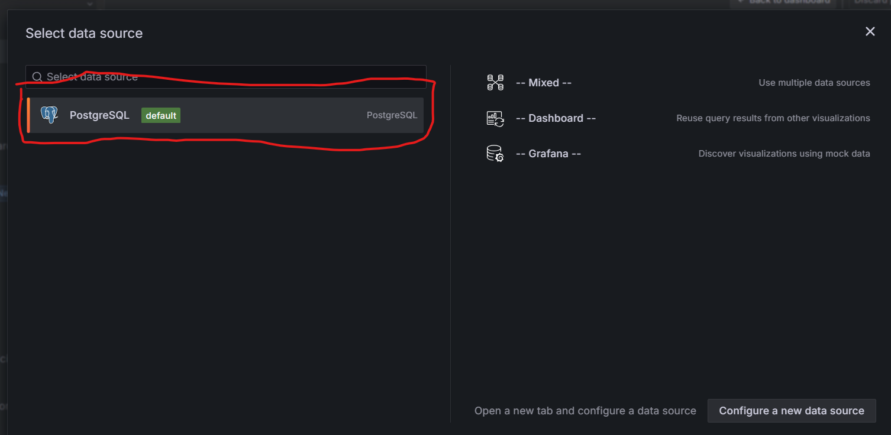
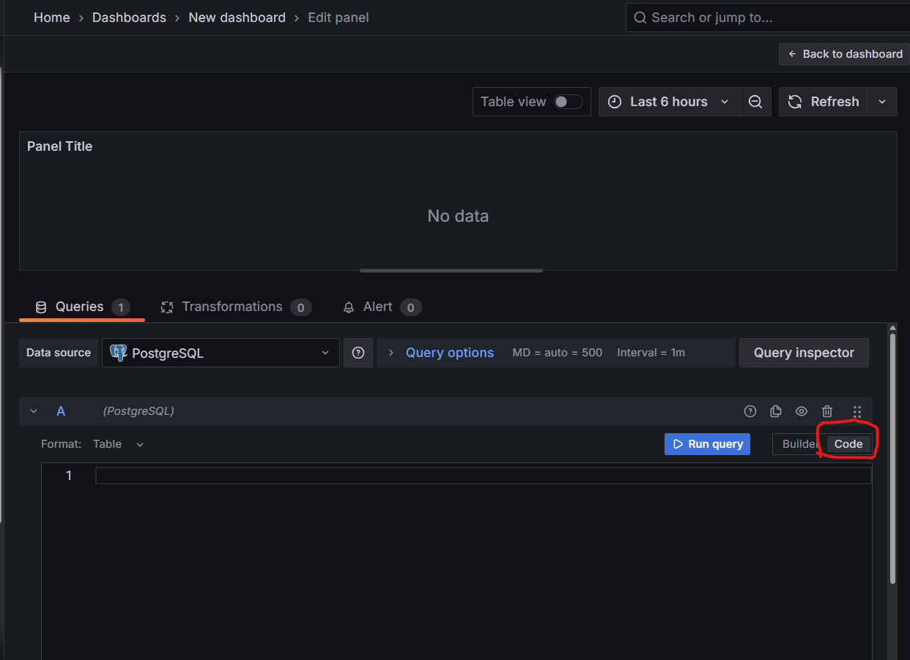
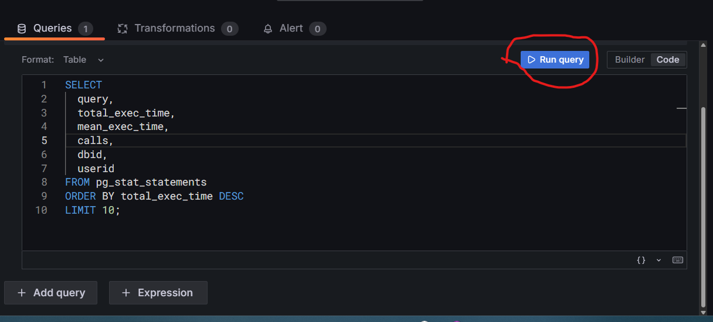
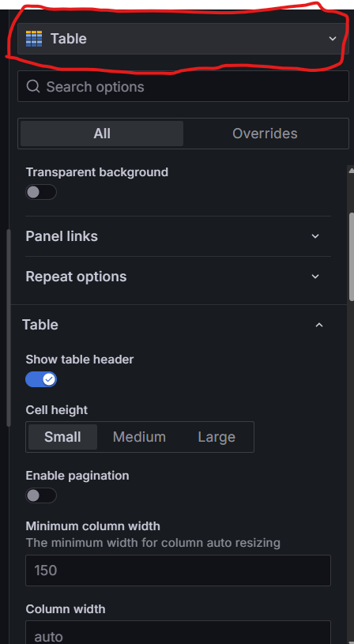

# Monitoring slowest query with Grafana, PostgreSQL, Nest.js

## How to run
```
docker compose up -d --build
```

## How to add visualize on dashboard

### 1. Hit the API to get slowest query data
```
curl http://localhost:3001/query/slow
```
### 2. Open `localhost:3000` on your browser

login with this credential

username: `admin`
password: `admin`

### 3. Click dashboard on the side panel



### 4. Click **New** dropdown and click New Dashboard



### 5. Click **+ Add Visualization**



### 6. Choose Postgresql data source 



### 7. click `Code` beside of `Builder` and paste this query



```
SELECT
  query,
  total_exec_time,
  mean_exec_time,
  calls,
  dbid,
  userid
FROM pg_stat_statements
ORDER BY total_exec_time DESC
LIMIT 10;
```

after paste this query, click **Run Query** button



### 8. You can choose visualization in the right side panel



